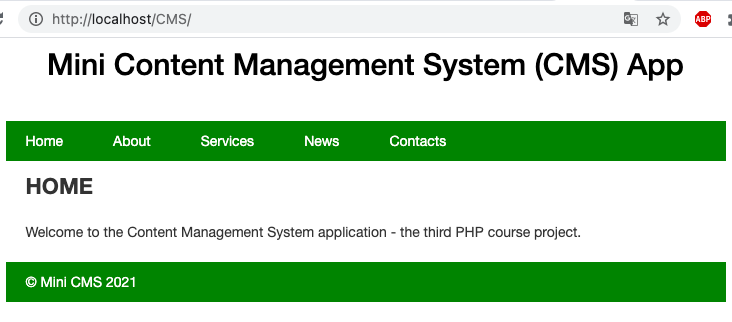
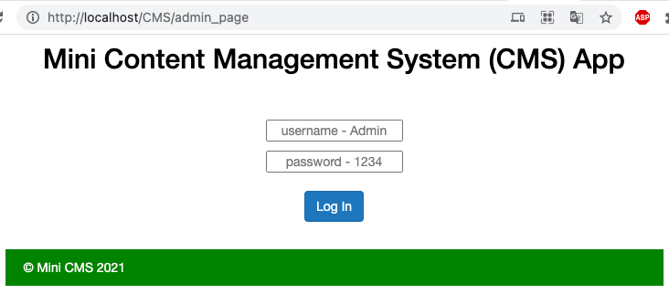
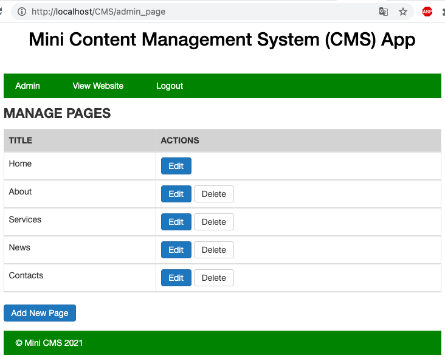
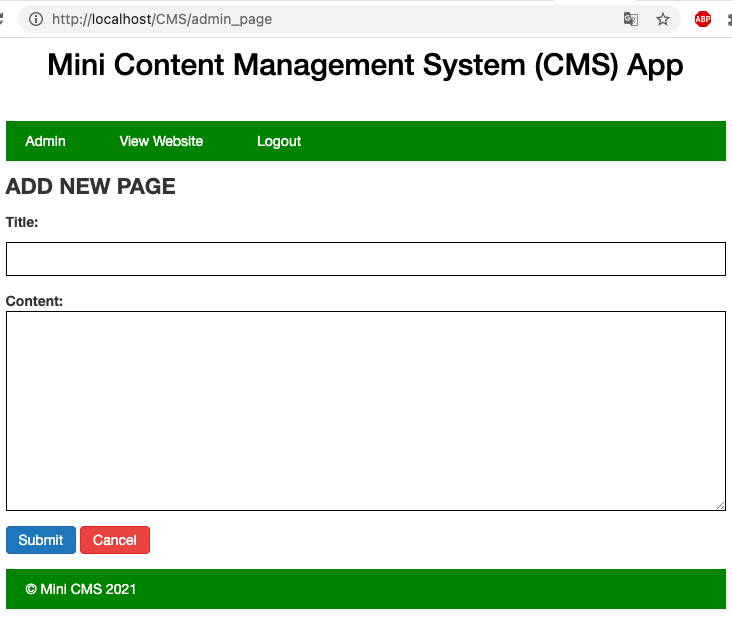
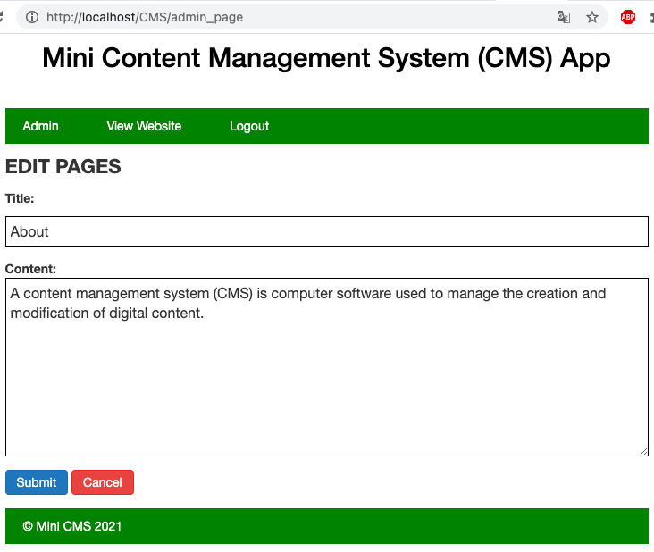

# SP3-CMS

Sprint #3 - Content Management System

The third PHP sprint task is to create a CMS appllication with CRUD (create/read/update/delete data from database) operations - use ORM, Composer, Entities and MVC. An admin is the one who is responsible for the content management part. After every operation content displays to end-users.

## Requirements

- PHP 5.2 or higher.
- [Zip extension](http://php.net/manual/en/book.zip.php) for zip and unzip actions
- [MySQL](https://dev.mysql.com/downloads/installer/) Database Service
- [XAMPP](https://www.apachefriends.org/download.html), [AMPPS](https://ampps.com/download) or other open-source web server platform
- Composer - a Dependency Manager
- Doctrine Object-Relational Mapper (ORM)

## Installation & Configuration

1. Download ZIP with latest version from master branch or clone repository https
2. Copy all the files to your website (XAMPP/AMPPS/other) folder. Please make sure that folder name is CMS
3. Install Composer locally (all necessary steps in https://getcomposer.org/download/), or globally (https://getcomposer.org/doc/00-intro.md#manual-installation)
4. Install Doctrine into project adding `php composer.phar require doctrine/orm` in terminal. Please double check if your are in current project directory
5. Update `bootstrap.php` file with your own MySQL connection parameters

```
    $conn = array(
        'driver'   => 'pdo_mysql',
        'host'     => '127.0.0.1', // or 'localhost'
        'dbname'   => 'sprint3',
        'user'     => 'root', // default username is root; if other change to your own
        'password' => 'mysqlroot' // change to your own server password
    );
```

6. Execute the following SQL query to create a database in MySQL

```
    CREATE DATABASE IF NOT EXISTS sprint3;
    USE sprint3;
```

7. Create a Page table in MySQL sprint3 database by running `vendor\bin\doctrine orm:schema-tool:update --force --dump-sql` if you use Windows CMD or `vendor/bin/doctrine orm:schema-tool:update --force --dump-sql` if you use Git Bash, Mac or Linux terminal. Please double check if your are in current project directory

8. Execute the following SQL query to insert default data inside your MySQl database. For more SQL query info use `sprint3_page.sql` file

```
    INSERT INTO page VALUES (1,'Home','Welcome to the Content Management System application - the third PHP course project.'),
        (2,'About','A content management system (CMS) is computer software used to manage the creation and modification of digital content.'),
        (3,'Services','Lorem ipsum dolor sit amet, consectetur adipiscing elit, sed do eiusmod tempor incididunt ut labore et dolore magna aliqua. Ut enim ad minim veniam, quis nostrud exercitation ullamco laboris nisi ut aliquip ex ea commodo consequat.'),
        (4,'News','Lorem ipsum dolor sit amet, consectetur adipiscing elit, sed do eiusmod tempor incididunt ut labore et dolore magna aliqua. '),
        (5,'Contacts','0000000\n1111111\n2222222\n3333333');
```

9. Open project with web browser (e.g. http://localhost/CMS/)
10. To reach Admin page use (e.g http://localhost/CMS/admin_page)
11. Default Admin username: `Admin`
12. Default Admin password: `1234`

## Project Features

### End-user is able to:

<ul>
<li> Navigate through pages</li>
<li> See pages name and content</li>
</ul>

### Admin is able to:

<ul>
<li> Login and Logout</li>
<li> View Website: see everything as end-user</li>
<li> Manage content: add/delete/update page data</li>
</ul>

<hr>

<hr>

<hr>

<hr>

<hr>


## Authors

[Jurgita](https://github.com/Jjurgita)
